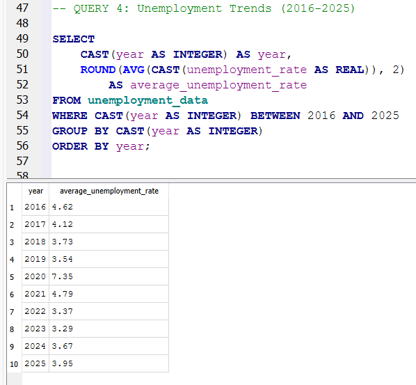
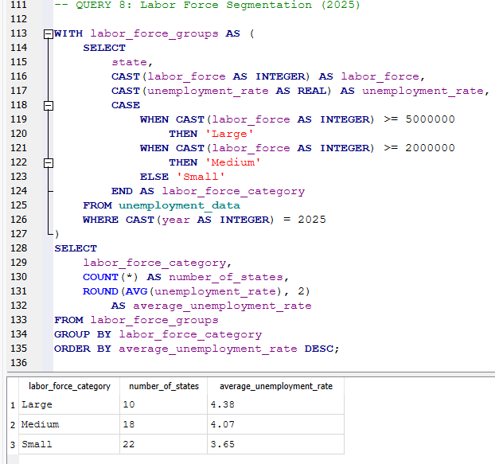

# U.S. Unemployment Trends | SQL Analysis

## Project Overview
Analyzed 2,500 annual unemployment records covering all 50 U.S. states from 1976 through 2025 using SQLite and DB Browser for SQLite.

The project examines geographic unemployment differences, historical trends, year-over-year changes, and labor force segmentation.

## Tools & Skills
- SQLite and DB Browser for SQLite
- Data cleaning and validation
- Aggregate functions: AVG(), MIN(), MAX(), COUNT()
- Filtering, grouping, and sorting
- Subqueries and self-joins
- Common Table Expressions (CTEs)
- Window functions: LAG() and RANK()
- CASE WHEN conditional logic

## Data Source
U.S. Bureau of Labor Statistics (BLS) — Local Area Unemployment Statistics (LAUS).

https://www.bls.gov/lau/tables.htm

Data covers 50 states and the years 1976–2025.

## Methodology
1. Downloaded annual state unemployment data from BLS.
2. Filtered the dataset to the 50 U.S. states.
3. Imported 2,500 records into SQLite.
4. Cleaned year labels and numeric fields containing thousands separators.
5. Validated state coverage, labor force reconciliation, and unemployment-rate ranges.
6. Developed eight SQL analyses covering unemployment trends and geographic comparisons.

## Key Findings
- California recorded the highest 2025 unemployment rate at 5.5%; South Dakota had the lowest at 2.1%.
- The unweighted average state unemployment rate in 2025 was 3.95%.
- 26 of 50 states had unemployment rates above the unweighted state average.
- Average state unemployment rose by 3.82 percentage points in 2020 and declined by 2.56 percentage points in 2021.
- New Jersey experienced the largest unemployment-rate increase between 2019 and 2025, at 1.7 percentage points.
- In 2025, states with large labor forces averaged 4.38% unemployment, compared with 4.07% for medium and 3.65% for small labor-force states.

These are descriptive findings from the dataset. State averages are unweighted and should not be interpreted as official national unemployment rates.

## SQL Analysis
The [SQL analysis script](unemployment_analysis.sql) contains eight queries covering rankings, historical trends, subqueries, self-joins, CTEs, window functions, and labor force segmentation.

## Screenshots

### State Unemployment Rankings

### Historical Unemployment Trends

### Labor Force Segmentation

## Project Files
- `US_Unemployment_Analysis.db` — SQLite database
- `unemployment_analysis.sql` — SQL analysis queries
- `US_Unemployment_Cleaned.csv` — cleaned source data
- `screenshots/` — query and result screenshots

## Data Notes
Unemployment-rate changes are expressed in percentage points. Labor force segmentation thresholds are analytical groupings created for this project, not official BLS classifications.
